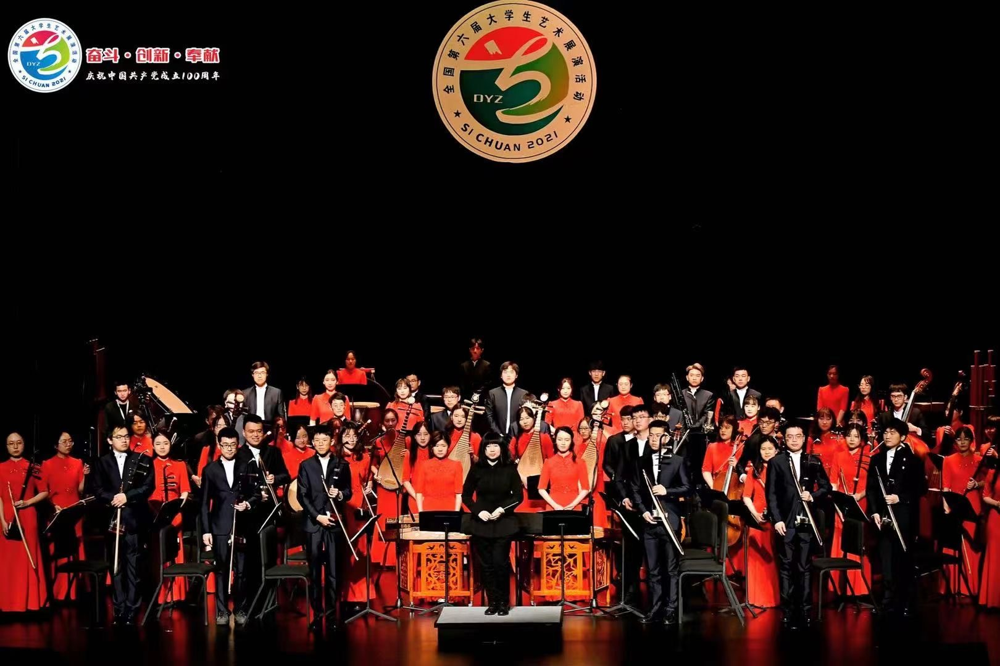
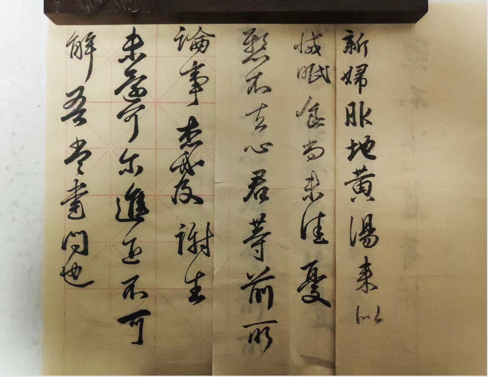
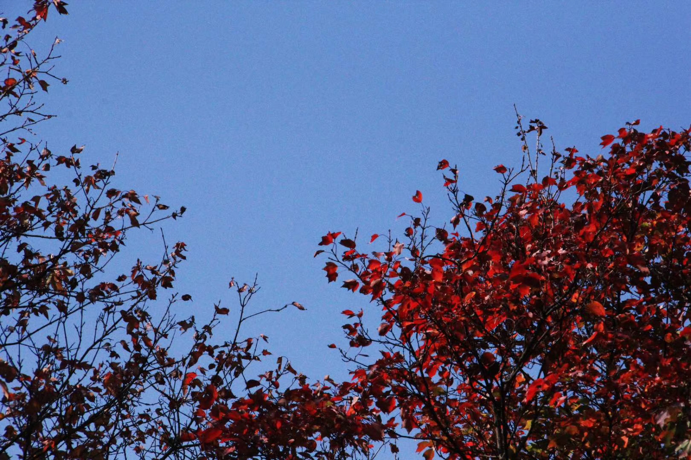

### Pan Xiao (潘啸)

 

 
- I am a second-year Ph.D. student at the college of Computer Science and Technology (CST) at Zhejiang University, supervised by [Prof. Yi Yang](https://scholar.google.com/citations?user=RMSuNFwAAAAJ&hl=en) and [Jingren Zhou](https://scholar.google.com/citations?user=64zxhRUAAAAJ&hl=en&oi=ao). I received my B.E. degree from the college of Control Science and Engineering (CSE) at Zhejiang University in 2019, supervised by Prof. Jianming Zhang and Prof. Wei Jiang. I spent two more years (2019 - 2021) in CSE as a postgraduate before transferring to CST for pursuing a Ph.D.. I am currently a research intern in Alibaba DAMO Academy. 

- Email: xiaopan@zju.edu.cn
- Google Scholar: [here](https://scholar.google.com/citations?user=5Rh3yn4AAAAJ&hl=en)

### Research Interest 
- Computer Vision; Person Re-identification; Video Object Segmentation; 3D Reconstruction;

### Publication
- ***[PR 2023] Dynamic Gradient Reactivation for Backward Compatible Person Re-identification***

  ***Xiao Pan**, Hao Luo, Weihua Chen, Fan Wang, Hao Li, Wei Jiang, Jianming Zhang, Jianyang Gu, Peike Li*
  
- ***[ICCV 2023] TransHuman: A Transformer-based Human Representation for Generalizable Neural Human Rendering*** 

  ***Xiao Pan**, Zongxin Yang, Jianxin Ma, Chang Zhou, Yi Yang*
  

- ***[ACM MM 2022] In-N-Out Generative Learning for Dense Unsupervised Video Segmentation*** 

  ***Xiao Pan**, Peike Li, Zongxin Yang, Huiling Zhou, Chang Zhou, Hongxia Yang, Jingren Zhou, Yi Yang*
  
  
- ***[KBS 2022] SFGN: Representing the Sequence with One Super Frame for Video Person Re-identification***

  ***Xiao Pan**, Hao Luo, Wei Jiang, Jianming Zhang, Jianyang Gu, Peike Li*
  
  
- ***[KBS 2022] Dynamic graph transformer for 3D object detection***

  *Siyuan Ren, **Xiao Pan**, Wenjie Zhao, Binling Nie, Bo Han*
  

### Education
- **B.E.**  College of Control Science and Engineering, Zhejiang University, 2015 - 2019
- **M.E.**  College of Control Science and Engineering, Zhejiang University, 2019 - 2021
- **Ph.D.** College of Computer Science and Technology, Zhejiang University, 2021 - Present

### Experience
- Research Intern, Alibaba DAMO Academy, 2021.6 - Present

### Miscs
- I started to play [ErHu](https://en.wikipedia.org/wiki/Erhu) (one of the most ancient Chinese traditional instruments with two strings) when I was 4 years old, taught by my father.
I was the head and concert master of Wenqin National Orchestra of Zhejiang University, where I spent 6 enjoyable years (2015 - 2021) and made many friends for life. 

 
- I am interested in Chinese calligraphy, and practice it sometimes. 

 

 
 
- I also take photographs in my spare time.

 
